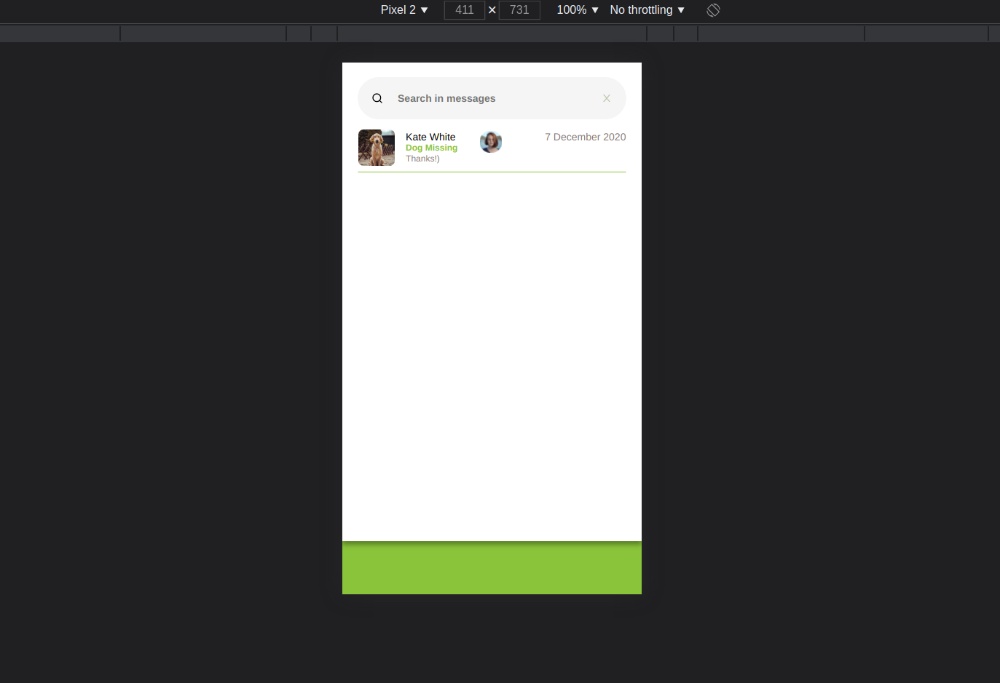

# Preview
---

---
# How to execute the project
---

This project was built using expo, to run it first you need to install expo:
Just type: `npm install expo-cli`, then navigate to the project folder and
type: `expo start`, the server should start on your browser.

On the menu in the left side, click on "Run in web browser", click with the
right button and then click in inspect. Change the view to mobile by clicking
on the mobile icon on the top left side of the inspect bar.